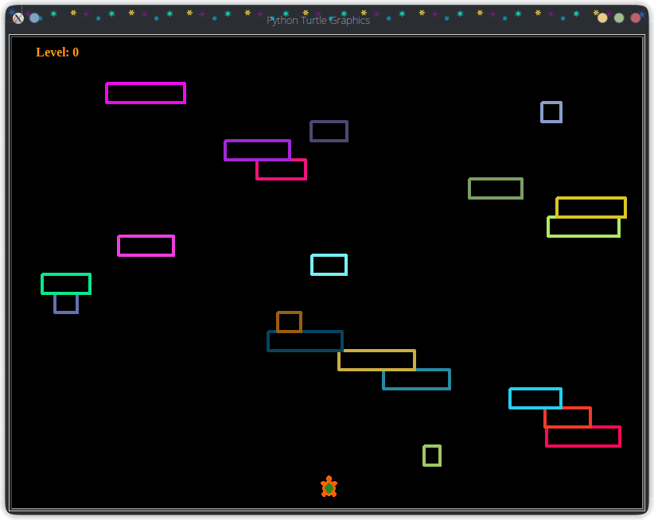

# Turtle_Crossing_Game
<table>
    <tr>
        <td>
        
        </td>
        <td>
            

                Turtle crossing game using python's module turtle
                 Few instructions ...
                <ul><li>To move the turtle Up to cross the street with moving cars, press the **Up** keypad</li></ul>
            

        </td>
    </tr>
</table>
